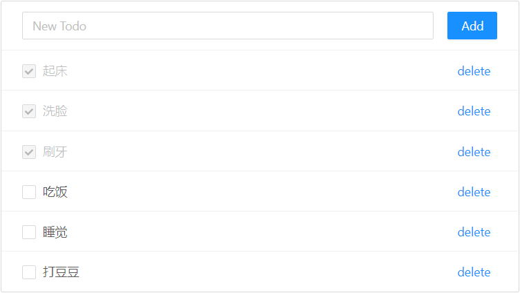
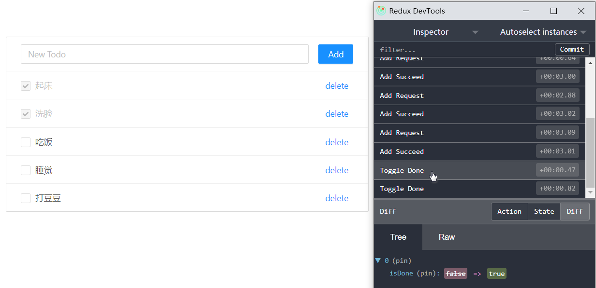

---

<div align="center">
    <b><em>ng-store</em></b><br>
    适用于Angular的Redux风格的单向数据流数据管理方案。
</div>

<div align="center">

[](http://opensource.org/licenses/MIT)

</div>

---

## What is ng-store?

Redux风格的单向数据流管理方案是目前前端最流行的数据管理方案。但Redux属于React社区，与Angular并不兼容。幸运的是Redux本身思想很简单，因此迁移到其他框架中并不困难。Angular社区有很多实现，比如：[NgRx](https://ngrx.io/)、[NgXs](https://www.ngxs.io/)、[angular-redux](https://github.com/angular-redux/store)等等。但这些方案普遍比较复杂，侵入性强，引入成本较高。要在已经开发了一段时间的项目中引入这些方案非常困难。

基于以上事实，我开发了ng-store这个库。它以单个Angular Service为单位来创建数据仓库（Store），而非传统Redux的全局唯一的Store，从而可以渐进式地引入单向数据流管理方案，侵入性小。

## Core Features

* 以单个Angular Service为单位来创建数据仓库（Store），轻量、灵活、侵入性小。
* 基于Rxjs创建，与Angular完美兼容。
* 可搭配[redux-devtools](https://github.com/reduxjs/redux-devtools)使用，提高开发效率。


## Quick Start

### 目标

开发一个Todo List应用。该应用包含如下功能：
* 增：添加一个新的Todo项目。
* 删：删除一个Todo项目。
* 改：将一个Todo项目状态置为“已完成”。
* 查：显示现在所有的Todo项目。

应用截图如下：



### 实施

1. 定义需要管理的应用状态，即state：

```ts
/** Todo项目 */
export interface TodoItem {
    id: number;
    content: string;
    isDone: boolean;
}

/**
 * State定义
 * 相当于数据表结构定义
 */
export interface State extends Array<TodoItem> {
}

/**
 * State初始状态
 * 相当于数据表初始状态
 */
export const initialState: State = [];
```

2. 定义对状态的操作，即actions：

```ts
/** 添加一个Todo项目 */
export class Add implements Action {
    readonly type = 'Add';

    constructor(public payload: TodoItem) { }
}

/** 切换一个Todo项目的完成标记 */
export class ToggleDone implements Action {
    readonly type = 'Toggle Done';

    constructor(public payload: number) { }
}

/** 移除一个Todo项目 */
export class Delete implements Action {
    readonly type = 'Delete';

    constructor(public payload: number) { }
}

export type ActionType =
    | Add
    | ToggleDone
    | Delete;
```

3. 定义响应action并修改当前state的归约函数，即reducer：

```ts
/**
 * 响应Action，对当前State进行修改。
 * reducer要么修改当前State，要么返回一个新State，覆盖当前State。
 */
function reducer(state: State, action: ActionType) {
    const adapter = createEntityAdapter(state, i => i.id); // EntityAdapter是辅助更新状态的包装类
    switch (action.type) {
        case 'Add':
            adapter.addOne(action.payload);
            break;

        case 'Toggle Done':
            adapter.updateOne(action.payload, i => {
                i.isDone = !i.isDone;
            });
            break;

        case 'Delete':
            adapter.removeOne(action.payload);
            break;

        default: return;
    }
}
```

4. 定义TodoService，它是state的容器，并负责提供发布action、响应action、调用reducer等功能。它本质上就是一个普通的Angular Service，唯一特殊点在于它继承自`NgStore`这个特殊的基类。

```ts
@Injectable()
export class TodoService extends NgStore<State, ActionType> {

    constructor() {
        super(initialState, reducer);
    }
}
```

5. 定义对state进行查询的函数，即selector：

```ts
export const getAll = (state: State) => state;
```

6. 在组件中，注入TodoService，并使用：

```ts
import * as fromTodo from './service/todo';
// 省略其他引用

@Component({
    selector: 'app-root',
    templateUrl: './app.component.html',
    styleUrls: ['./app.component.less'],
    providers: [fromTodo.TodoService] // 组件级注入，将Service的作用域限制在了当前组件
})
export class AppComponent implements OnInit {
    inputTodo = '';
    todoItem$: Observable<TodoItem[]>;
    id = 0;

    constructor(private todoStore: fromTodo.TodoService) {
    }

    ngOnInit() {
        // 调用selector进行查询，得到状态数据流
        this.todoItem$ = this.todoStore.select(fromTodo.getAll);
    }

    add() {
        // 发布Add Action
        this.todoStore.dispatch(new fromTodo.Add({ id: this.id++, content: this.inputTodo, isDone: false }));
        this.inputTodo = '';
    }

    toggleDone(todo: TodoItem) {
        // 发布ToggleDone Action
        this.todoStore.dispatch(new fromTodo.ToggleDone(todo.id));
    }

    delete(todo: TodoItem) {
        // 发布Delete Action
        this.todoStore.dispatch(new fromTodo.Delete(todo.id));
    }
}
```

以上便完成了Todo List的开发（视图模板和样式省略）。

## 文档

### 处理异步Action

前端应用中大量操作都是异步的。在ng-store中，引入了`effect`的概念，用来表示非同步的操作。具体来讲，可以使用`@effect`注解，来定制一个Observable管道，将一个Action转换为另一个Action。借由Rxjs的特性，这个管道当中可以执行异步操作。

以Quick Start中的应用为例，现在我们假设，“添加Todo”这个流程是异步的，需要先发送请求到后端，然后后端返回包含id的Todo实例。那么如何实现该功能？

1. 重构actions，将Add拆分为AddRequest和AddSucceed两个Action。

```ts
/** 发送Add请求 */
export class AddRequest implements Action {
    readonly type = 'Add Request';

    constructor(public payload: string) { }
}

/** 后端返回Add成功响应 */
export class AddSucceed implements Action {
    readonly type = 'Add Succeed';

    constructor(public payload: TodoItem) { }
}
```

2. 组件中，修改发布的action为AddRequest。

```ts
    add() {
        this.todoStore.dispatch(new fromTodo.AddRequest(this.inputTodo));
        this.inputTodo = '';
    }
```

3. Reducer中，不再响应Add，而是响应AddSucceed。

```ts
function reducer(state: State, action: ActionType) {
    const adapter = createEntityAdapter(state, i => i.id);
    switch (action.type) {
        case 'Add Succeed':
            adapter.addOne(action.payload);
            break;
    ......
```

4. TodoService中，创建一个管道，将Add action映射为Add Succeed action，并标注为`@effect`：

```ts
@Injectable()
export class TodoService extends NgStore<State, ActionType> {

    // 将Add action映射为Add Succeed action
    @effect({ description: '添加新Todo的流程' })
    private add$ = this.actions.pipe(
        ofType(AddRequest),
        map(i => i.payload),
        mergeMap(content => {
            return this.sendAddRequest(content).pipe(
                map(todo => new AddSucceed(todo))
            );
        })
    );

    constructor() {
        super(initialState, reducer);
    }

    // 用这个Mock方法模拟后端响应过程
    private id = 0;
    private sendAddRequest(content: string): Observable<TodoItem> {
        return of({ id: this.id++, content, isDone: false }).pipe(
            delay(3000)
        );
    }
}
```

至此我们完成了异步改造。

### 引入redux-devtools

引入redux-devtools的方法很简单，只需要在浏览器中安装redux-devtool插件，然后在应用根模块中引入NgStoreModule，并添加配置参数：

```ts
import { NgStoreModule } from 'ng-store';
import { environment } from '../environments/environment';

@NgModule({
    declarations: [
        AppComponent
    ],
    imports: [
        // 将enableDevTool置为true
        NgStoreModule.forRoot({ enableDevTool: !environment.production }),
        // ... 省略其他模块
    ],
    providers: [],
    bootstrap: [AppComponent]
})
export class AppModule { }
```

此后，便可以用redux-devtools来跟踪Store中的Action流和状态变化。


